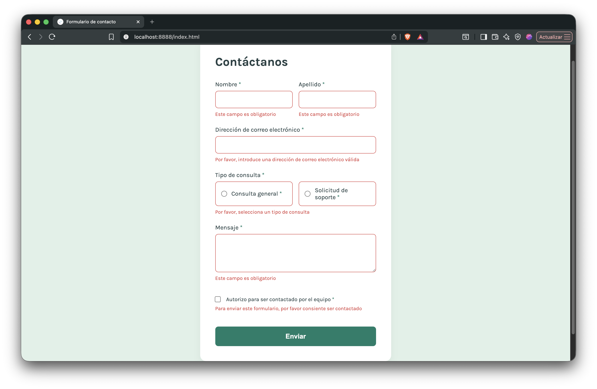
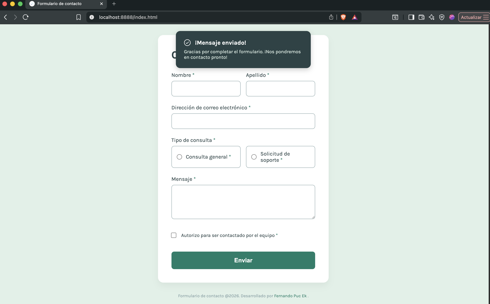

Solución del formulario de contacto

## Tabla de contenidos

- [Resumen](#resumen)
  - [Captura de pantalla](#captura-de-pantalla)
  - [Enlaces](#enlaces)
- [Autor](#autor)

## Resumen

Tu desafío es construir este formulario de contacto y lograr que se vea lo más cercano posible al diseño. Presta especial atención a hacer que este formulario sea accesible. Construir formularios accesibles es una habilidad clave para los desarrolladores front-end. 

Además de construir el frontend del formulario de contacto, también deberás implementar una parte de back-end para manejar el envío y recepción de información desde una base de datos. Así que este es un desafío perfecto para identificar el nivel de conocimiento en programacion web.

### El desafío

Tus usuarios deberían poder:

- Completar el formulario y ver un mensaje de éxito al enviarlo correctamente
- Recibir mensajes de validación del formulario si:
  - Se ha omitido un campo obligatorio
  - La dirección de correo electrónico no está correctamente formateada
- Completar el formulario solo usando su teclado
- Tener los inputs, mensajes de error y el mensaje de éxito anunciados en su lector de pantalla
- Ver el diseño óptimo para la interfaz dependiendo del tamaño de la pantalla de su dispositivo
- Ver estados de hover y focus para todos los elementos interactivos en la página
- Enviar el formulario y almacenar los datos en la base de datos.
- Recuperar y ver todos los envíos del formulario desde la base de datos.

Asegúrate de documentar tu configuración y cualquier instrucción especial para el uso o acceso al site del formulario  para que el docente puedan entender y ejecutar tu proyecto fácilmente.

### Captura de pantalla

**Vista de Escritorio:**

**Mensajes de Error:**

**Mensajes de Enviado:**

### Enlaces

- URL en GITHUB de tu proyecto: https://github.com/fergood-2703/formulario-php
- URL del site:[Agrega la URL del sitio en vivo aquí](https://your-live-site-url.com)

## Autor
- Nombre completo: Omar Fernando Puc Ek
- N° Control: 211K0070
- Grupo: A
- Sitio  - [Omar Fernando Puc Ek](https://www.linkedin.com/in/fernando-puc-ek-061154226/)
- Github - [@fergood-2703](https://github.com/fergood-2703)

